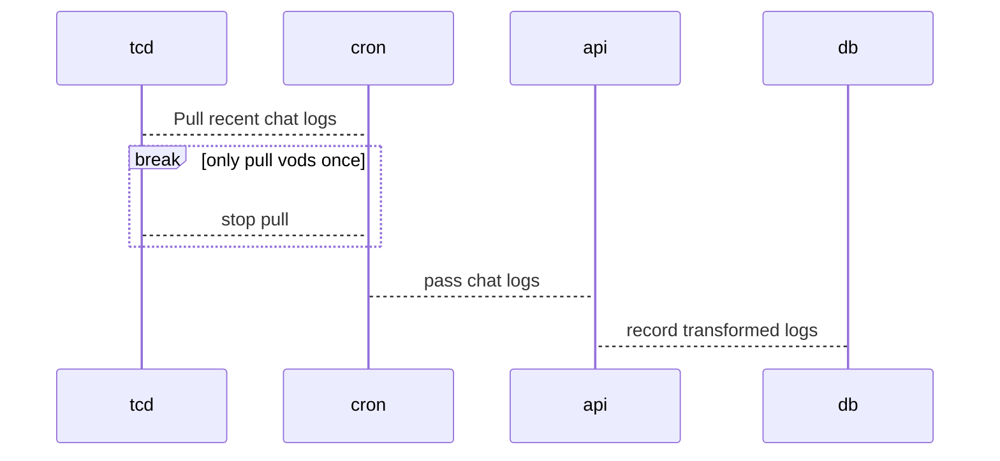

# PPS - Pogs Per Second
## Structure  
REQ: https://github.com/PetterKraabol/Twitch-Chat-Downloader

- tcd is normally command line tcd --channel --first=#
- need good way to insightfully represent emotes in a time period  
- identify high emote density moments  
- a good way to transform and store emote data from a vod, along with its time data  
- endpoints to return insightful data / moments
- can get emotes from bttv endpoint
- mixpanel and segment, emit segment data
- subprocess standard library